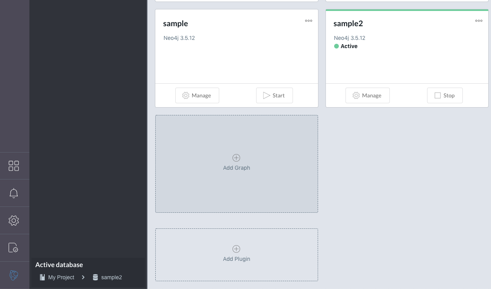
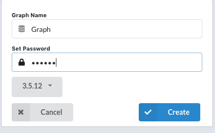

<div align="center">
    
</div>

# install

```bash
pip install ACOCrawler
```

or

```bash
git clone https://github.com/Ganariya/ACOCrawler.git
pip install -e .
```

or 

```bash
git clone https://github.com/Ganariya/ACOCrawler.git
cd ACOCrawler
```

# README.md

[Japanese README.md](./Japan/README.md)

# What's this

ACOCrawler is a focused crawler with ant colony optimization and neo4j.

ACOCrawler crawls on the Internet with keyword and keywords, and scrape pages in the neo4j.

So, you can crawl pages related to keyword online automatically.

# What's benefit

A crawler which is used by some company or users uses breadth first search (BFS), so such crawlers become less accurate later in the search.
And such crawler doesn't have visualize tools, so there is only csv files you can see after finishing crawling.

ACOCrawler crawls with ant colony optimization method, so this crawler can scrape related pages to the keyword and keywords, with some randomness.
And ACOCrawler uses [Graph Database Neo4j](https://neo4j.com/), so you can visualize the steps in crawling, and happy to scaling datas and cyper-queries.

# How to Use to Use

1. Please install ACOCrawler from PyPI install, or git clone or so.
2. Please install [Neo4j Desktop Application](https://neo4j.com/download/).
3. Activate Neo4j Desktop Application, and make a user names **neo4j**. ACOCrawler doesn't still correspondes to custom user name and custom database password.
4. Press the Add Graph Button, and select local graph.
    - 
5. Set graph name and password, and password is **neo4jj**.(ACOCrawler is going to deal with custom user name and password in the future fix.) 
    - 
6. Activate such graph database which was made step 5.
7. Let's Use ACOCrawler from source code, or command line interface.

# How to Use

### Source Code

example.py
```python
from ACOCrawler.acocrawler import AcoCrawler

# the keyword you want to crawl
keyword = "competitive programming"

# the keywords related to keyword
keywords = [
    "competitive programming",
    "c++",
    "atcoder",
    "codeforces",
    "yukicoder"
]

# how many cycles you scrape
num_of_cycles = 100

# how many ants to scrape
num_of_ants = 10

# ant colony optimization parameters with max-min aco
alpha = 1
beta = 1
rho = 0.9
lower = 0.0001
upper = 1

# parameters to score the page
# how related to keyword
base_phe = 100
init_phe = 0.001

# the parameter score is larger than collect_norm, neo4j saves the page
# if score < collect_norm, this page doesn't include neo4j because this page doesn't relate to keyword.
collect_norm = 0.00001

# parameter
# init_node parameter
init_node_score = 0.1

crawler = AcoCrawler(keyword=keyword, num_of_cycles=num_of_cycles, num_of_ants=num_of_ants, keywords=keywords, alpha=alpha, beta=beta, rho=rho, lower=lower, upper=upper, base_phe=base_phe, init_phe=init_phe, collect_norm=collect_norm, init_node_score=init_node_score)

# start node makes
crawler.start()

# aco
crawler.solve()

crawler.finish()
```

### Command Line Interface

crawl example
```bash
ACOCrawler crawl --keyword "competitive programming" --keywords atocder --keywords codeforces --keywords c++ 
```

crawl help
```bash
ACOCrawler crawl --help

Usage: ACOCrawler crawl [OPTIONS]

Options:
  --init_node_score FLOAT
  --collect_norm FLOAT
  --init_phe FLOAT
  --base_phe FLOAT
  --upper FLOAT
  --lower FLOAT
  --rho FLOAT
  --beta FLOAT
  --alpha FLOAT
  --num_of_ants INTEGER
  --num_of_cycles INTEGER
  --keywords TEXT
  --keyword TEXT
  --help                   Show this message and exit.
```

# Future

- Add Natural Language Processing
    - From bookmarks and history from browsers, make models and search pages related to models.
    - If we don't give keywords, keyword and word2vec can calculate similarities.
    - These NLP's function can make in my private repository, but I cannot make well in package, dirty source code, I'll make fix. 
    
# Question or Bug Report

If you have questions, or have some requests, bag reports, please tell me by issues!
Thank you!

# Reference Paper

[Adaptive Web Search Based on a Colony of Cooperative Distributed Agents](https://link.springer.com/chapter/10.1007/978-3-540-45217-1_13)

